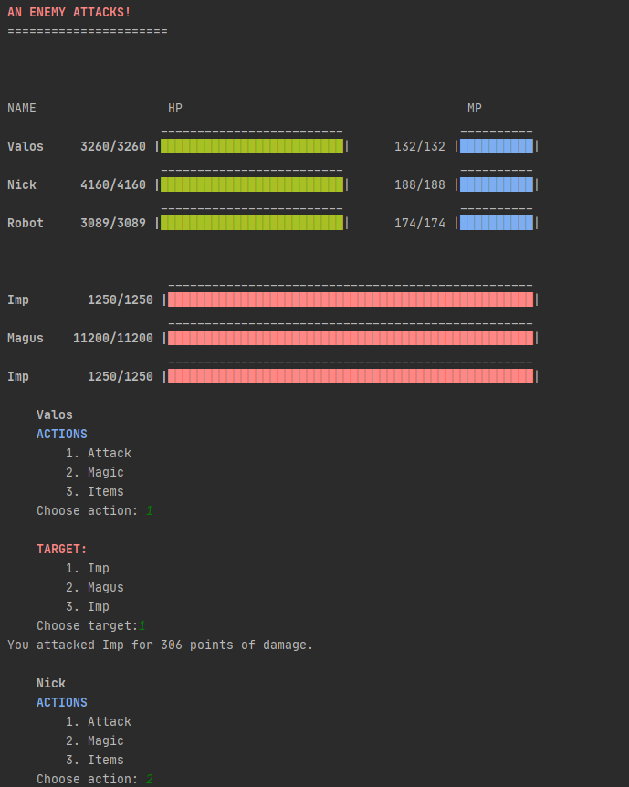

# RPG Battle Script

A simple implementation of classic RPG games written in Python, this battle script allows the player to command three characters in a 3v3 battle. Features include a basic user interface with updating health bars, item and magic usage by both parties as well as a simple artifical intelligence for the enemy party.  

#### Figure: An instance of the running program with the menu and health bars visible
